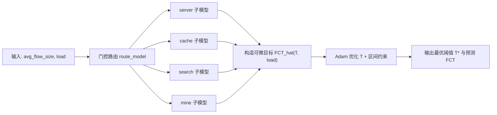

# FCT 优化项目

## 1. 项目介绍

本项目面向数据中心流调度参数优化问题：
给定网络场景特征 `(avg_flow_size, load)`，自动找到使 **FCT (Flow Completion Time)** 最小的阈值配置（`T1` 或 `T2`）。

项目采用“两阶段”方案：
1. 训练阶段：学习连续函数 `FCT = f(T_kb, load)`。
2. 推理阶段：在学习到的连续函数上，用梯度下降搜索最优阈值。

核心价值：
1. 将离散实验点扩展为连续优化问题，避免“只在采样点中选最优”的限制。
2. 通过门控路由把不同流量类型拆为 4 个子问题，提升拟合精度与稳定性。

---

## 2. 解决的问题与方法

### 2.1 问题定义

我们希望求解：

- 输入：`avg_flow_size`（平均流大小，字节）、`load`（网络负载）
- 输出：最优阈值 `T*`（server/cache 优化 `T1`；search/mine 优化 `T2`）

数学形式：

\[
T^* = \arg\min_{T \in [T_{min}, T_{max}]} \hat f_m(T, load)
\]

其中：
1. \(m\) 是由门控函数 `route_model(avg_flow_size)` 选择的子模型。
2. \(\hat f_m\) 是神经网络学习得到的 FCT 预测函数（单位 us）。

### 2.2 门控路由

\[
m = \text{route}(avg\_flow\_size)
\]


### 2.3 训练目标（监督回归）

对每个子模型独立训练：

1. 输入特征：`x = [T_kb, load]`
2. 目标变量：`y = log(avg_fct)`
3. 标准化后最小化 MSE：

\[
\mathcal{L}(\theta)=\frac{1}{N}\sum_{i=1}^{N}(\hat z_i-z_i)^2
\]

其中 \(z\) 是 `log(FCT)` 经过 `StandardScaler` 后的值。

### 2.4 推理优化（可微搜索）

固定 `load`，将阈值 `T` 当作可学习参数，使用 Adam 更新：

\[
T_{k+1} = \Pi_{[T_{min},T_{max}]}
\big(T_k - \eta \nabla_T \hat f_m(T_k, load)\big)
\]

其中 \(\Pi\) 表示区间投影（代码中用 `clamp_` 实现）。

### 2.5 过程示意图



---

## 3. 实验设置

### 3.1 数据集与任务拆分

使用 `dataset/all_data/`（合并后的数据）：

| 模型 | 样本数 | 变化阈值 | 固定阈值 | 优化目标 |
|------|--------|----------|----------|----------|
| server | 108 | `t1_kb` | `t2_kb=1024` | T1 |
| cache  | 111 | `t1_kb` | `t2_kb=1024` | T1 |
| search | 89  | `t2_kb` | `t1_kb=100`  | T2 |
| mine   | 54  | `t2_kb` | `t1_kb=100`  | T2 |

总样本数：`362`

### 3.2 模型结构

每个子模型均为 MLP：

1. `2 -> 64 -> 32 -> 1`
2. 激活：ReLU
3. Dropout：0.2（第一隐藏层后）
4. 输出：标准化后的 `log(FCT)`

### 3.3 训练配置

1. 划分：`70% train / 15% val / 15% test`
2. 优化器：Adam (`lr=0.001`, `weight_decay=1e-5`)
3. 调度器：ReduceLROnPlateau (`factor=0.5`, `patience=20`)
4. 早停：`patience=30`
5. `batch_size=32`，`max_epoch=500`

### 3.4 推理优化配置

1. 优化器：Adam
2. Warm Start：维护 `(model, load_bin) -> T_init` 表（`analysis/warm_start_table.json`）
3. 参数策略：
   - warm_start 命中：`lr=8.0`, `max_iter=60`
   - warm_start 未命中：`lr=20.0`, `max_iter=100`
4. 早停：
   - 连续无改善早停
   - 梯度与 `ΔT/ΔFCT` 稳定收敛早停
5. 阈值范围：
   - server/cache：`[10, 250] KB`
   - search/mine：`[512, 2048] KB`

### 3.5 实验记录工具

已从 TensorBoard 迁移到 **SwanLab**：
1. 训练过程：`train/loss`、`val/loss`、学习率、测试指标
2. 推理过程：阈值收敛、FCT 收敛、推理耗时
3. 图像上传：loss 曲线、FCT 响应曲线、优化过程图

---

## 4. 实验结果

> 训练结果来源：`models/*/training_results.json`

### 4.1 测试集指标（子模型回归）

| 模型 | MAE (us) | RMSE (us) | MAPE (%) |
|------|----------|-----------|----------|
| server | 6,401.96 | 15,974.79 | 4.38 |
| cache  | 17,217.95 | 28,407.83 | 2.83 |
| search | 27,629.81 | 32,558.67 | 2.70 |
| mine   | 158,553.92 | 199,070.88 | 7.56 |

结论：
1. `server/cache/search` 的 MAPE 均在 5% 左右或更低，拟合效果较好。
2. `mine` 场景误差更高，说明超大流场景仍有改进空间（样本量较少且波动更大）。

### 4.2 推理优化结果摘要

> 来源：`analysis/inference_results_20260418_183524.json`

| 模型 | 平均推理耗时 (ms) | 最小/最大耗时 (ms) | 预测FCT范围 (ms) |
|------|------------------|--------------------|------------------|
| server | 11.43 | 10.51 / 13.39 | 22.86 ~ 643.89 |
| cache  | 18.65 | 10.27 / 36.14 | 153.60 ~ 2050.70 |
| search | 12.58 | 10.92 / 14.16 | 402.96 ~ 2481.06 |
| mine   | 12.66 | 10.63 / 16.90 | 1954.53 ~ 3773.31 |

总体平均推理耗时：`13.83 ms`（20 个场景平均）。

### 4.3 可视化产物

1. `analysis/fct_response_curves.png`
2. `analysis/optimization_process.png`
3. SwanLab 面板中的训练/推理曲线与图像记录

---

## 5. 项目结构

```text
Fct-optimization/
├── dataset/
│   ├── raw_data/
│   ├── cleaned_data/
│   ├── new_data/
│   └── all_data/
├── models/
│   ├── server/
│   ├── cache/
│   ├── search/
│   └── mine/
├── analysis/
├── logs/
│   ├── train/
│   └── inference/
├── scripts/
│   ├── model.py
│   ├── train_fct_predictor.py
│   ├── predict_optimal_threshold.py
│   ├── evaluate_dynamic_vs_fixed.py
│   ├── app.py
│   ├── eda.py
│   └── check_env.py
├── docs/
├── requirements.txt
└── README.md
```

---

## 6. 快速开始

```bash
# 1) 创建并激活环境（你当前用的是 DL）
conda activate DL

# 2) 安装依赖
pip install -r requirements.txt

# 3) 环境检查
python scripts/check_env.py

# 4) 训练
python scripts/train_fct_predictor.py

# 5) 推理优化
python scripts/predict_optimal_threshold.py
```

---

## 7. 关键接口

```python
from scripts.predict_optimal_threshold import find_optimal_threshold

result, fct = find_optimal_threshold(
    avg_flow_size=615 * 1024,
    load=0.5,
)

print(result)
# {
#   'model': 'cache',
#   't1': xxx,
#   't2_kb': 1024.0,
#   'predicted_fct_us': xxx
# }
```

---

## 8. 后续改进方向

1. 测量动态最优阈值对应的真实 FCT（当前评估中动态侧以预测值为主）。
2. 补足样本较少场景的数据（重点：`search`、`mine`）。
3. 引入不确定性估计（如 MC Dropout/深度集成），给出阈值建议置信区间。
4. 将门控路由从硬阈值升级为可学习分类器，减少边界样本误路由风险。
