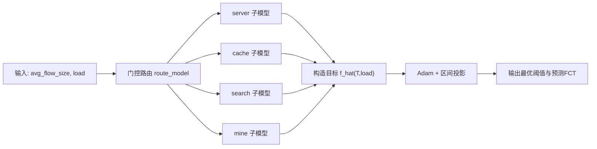
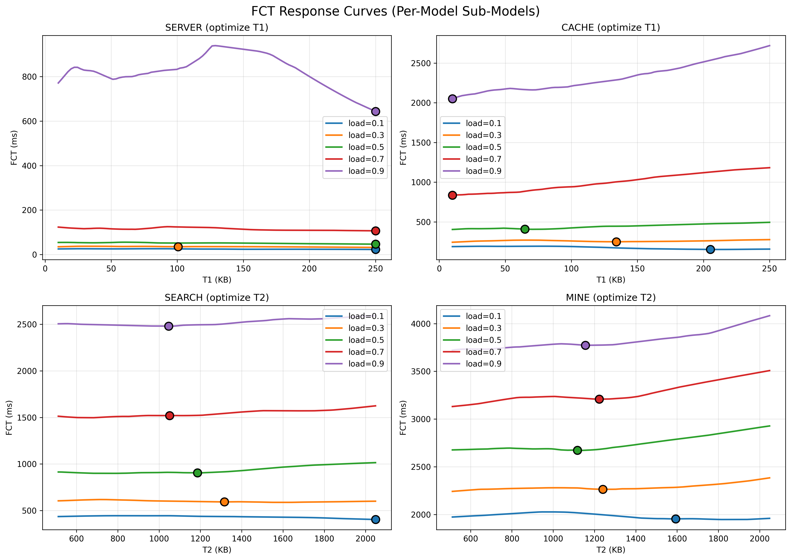
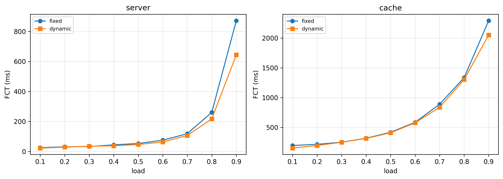
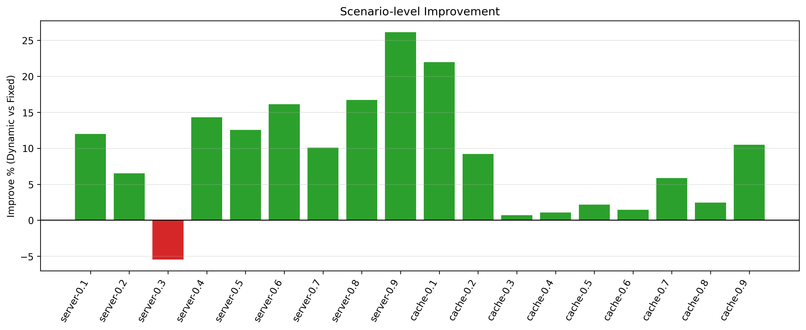
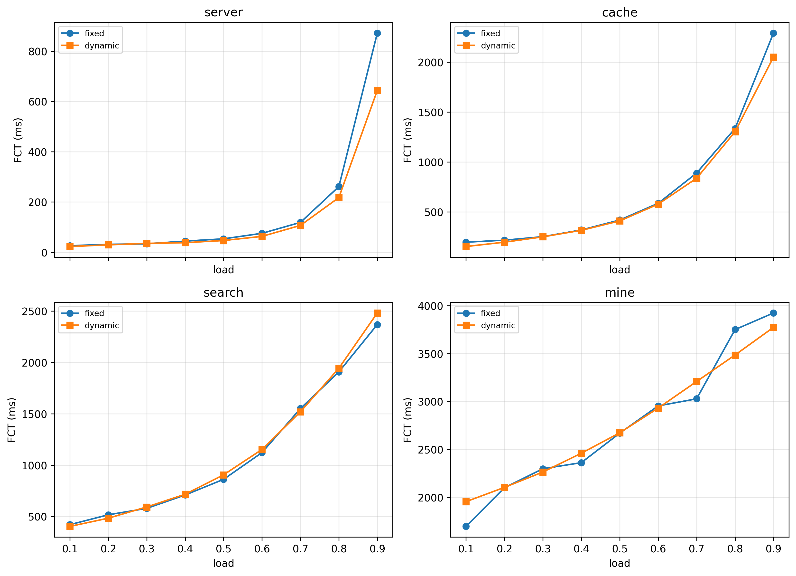

# 4-18 汇报文档

## 1. 数学问题抽象

目标：给定网络场景特征，求最优阈值使 FCT 最小。

输入变量：
1. \(avg\_flow\_size\)：平均流大小（Byte）
2. \(load\)：网络负载（0~1）

输出变量：
1. \(T^*\)：最优阈值（KB）
2. 对应 FCT（预测值或实测值）

优化问题：

\[
T^*=\arg\min_{T \in [T_{\min},T_{\max}]}\hat f_m(T,load)
\]

子模型路由：

\[
m=\mathrm{route}(avg\_flow\_size),\quad
m \in \{server, cache, search, mine\}
\]

符号说明：
1. \(\hat f_m\)：子模型 \(m\) 的 FCT 预测函数
2. \(T_{\min},T_{\max}\)：阈值搜索边界
3. \(m\)：场景模型标签

---

## 2. 两阶段求解原理与过程

## 2.1 阶段一：函数学习（训练）

每个子模型单独训练，学习 `FCT = f(T, load)`。

损失函数（MSE）：

\[
\mathcal{L}(\theta)=\frac{1}{N}\sum_{i=1}^{N}(\hat z_i-z_i)^2
\]

变量定义：
1. \(\theta\)：模型参数
2. \(N\)：样本数
3. \(z_i\)：第 \(i\) 个样本真实目标（标准化后的 `log(FCT)`）
4. \(\hat z_i\)：模型预测目标

## 2.2 阶段二：阈值优化（推理）

将阈值 \(T\) 作为可学习变量，在固定 `load` 下迭代优化：

\[
T_{k+1}=\Pi_{[T_{\min},T_{\max}]}\left(T_k-\eta\nabla_T\hat f_m(T_k,load)\right)
\]

变量定义：
1. \(k\)：迭代步
2. \(\eta\)：学习率
3. \(\nabla_T\hat f_m\)：对阈值的梯度
4. \(\Pi_{[T_{\min},T_{\max}]}\)：区间投影算子（保证阈值不越界）

---

## 3. 流程示意

---

## 4. 现有实验结果

## 4.1 训练结果
| 模型 | MAE (us) | RMSE (us) | MAPE (%) | 
|------|----------|-----------|----------|
| server | 6402 | 15975 | 4.38 |
| cache  | 17218 | 28408 | 2.83 | 
| search | 27630 | 32559 | 2.70 | 
| mine   | 158554 | 199071 | 4.56 | 

## 4.2 推理结果

| 模型 | 平均 (ms) | 最低 (ms) |
|------|----------|----------|
| server | 11.43 | 10.51 |
| cache  | 18.65 | 10.27 |
| search | 12.58 | 10.92 |
| mine   | 12.66 | 10.63 |

## 4.3 动态阈值评估结果

---

## 5. 评估方案

1. 对比对象：动态阈值 vs 固定阈值基线  
2. 固定基线定义：  
   - `server/cache`: `t1_kb=100`, `t2_kb=1024`  
   - `search/mine`: `t1_kb=100`, `t2_kb=1024`  
3. 当前动态方案使用 `predicted_fct_us`  
4. 核心指标：

\[
\text{improve\_pct}=\frac{FCT_{\text{fixed}}-FCT_{\text{dynamic,pred}}}{FCT_{\text{fixed}}}\times100\%
\]

5. 汇总指标：平均降幅、中位数降幅、Win Rate、最优/最差场景。

