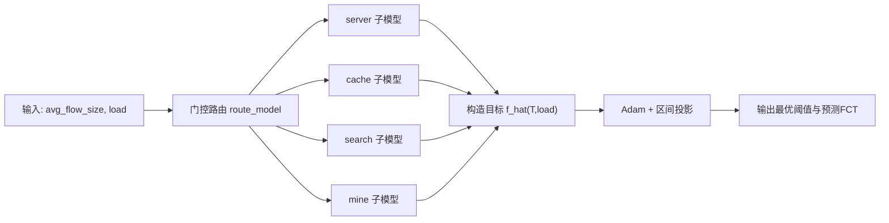

# 项目原理解释文档

## 1. 问题定义

本项目目标：在给定网络场景特征下，自动选择阈值参数，使平均流完成时间（FCT）最小。

输入：
1. `avg_flow_size`：平均流大小（Byte）
2. `load`：网络负载（无量纲，0~1）

输出：
1. 最优阈值 `T*`（对于 `server/cache` 是 `T1`；对于 `search/mine` 是 `T2`）
2. 对应预测 FCT

---

## 2. 数学问题抽象

记：
1. \(m\)：流量子模型标签，\(m \in \{server, cache, search, mine\}\)
2. \(\hat f_m(T, load)\)：子模型 \(m\) 下的 FCT 预测函数（单位 us）
3. \([T_{\min}, T_{\max}]\)：阈值可行区间

则优化问题为：

\[
T^*=\arg\min_{T \in [T_{\min},T_{\max}]}\hat f_m(T, load)
\]

其中 \(m\) 由门控函数决定：

\[
m=\mathrm{route}(avg\_flow\_size)
\]

---

## 3. 变量定义（统一符号表）

1. \(T\)：待优化阈值（KB）
2. \(T^*\)：最优阈值（KB）
3. \(T_k\)：第 \(k\) 次迭代时阈值
4. \(load\)：网络负载
5. \(avg\_flow\_size\)：平均流大小
6. \(\hat f_m\)：第 \(m\) 个子模型预测函数
7. \(\theta\)：模型参数
8. \(N\)：样本数量
9. \(z_i\)：第 \(i\) 个样本真实目标（标准化后的 `log(FCT)`）
10. \(\hat z_i\)：第 \(i\) 个样本预测目标
11. \(\eta\)：学习率
12. \(\Pi_{[T_{\min},T_{\max}]}\)：区间投影算子（代码中对应 `clamp_`）

---

## 4. 两阶段算法原理

## 4.1 阶段一：函数学习（训练）

思路：用监督学习拟合连续函数 \(\hat f_m(T,load)\)。

每个子模型的训练目标：

\[
\mathcal{L}(\theta)=\frac{1}{N}\sum_{i=1}^{N}(\hat z_i-z_i)^2
\]

其中：
1. \(z_i=\mathrm{Standardize}(\log(FCT_i))\)
2. \(\hat z_i\) 为模型输出

为什么这样做：
1. `log(FCT)` 缩小尺度差异，训练更稳定
2. 标准化后损失更可优化
3. 每个模型单独拟合，减少异构流量分布干扰

## 4.2 阶段二：阈值优化（推理）

对固定场景 `(m, load)`，把阈值 \(T\) 当作可学习变量，沿梯度下降：

\[
T_{k+1}=\Pi_{[T_{\min},T_{\max}]}\left(T_k-\eta \nabla_T \hat f_m(T_k,load)\right)
\]

解释：
1. \(\nabla_T \hat f_m\)：FCT 对阈值的梯度
2. 负梯度方向更新可降低预测 FCT
3. \(\Pi\) 保证阈值不越界

---

## 5. 门控路由原理

基于 `avg_flow_size` 的区间映射：
1. `< 200KB -> server`
2. `200KB ~ 1MB -> cache`
3. `1MB ~ 3MB -> search`
4. `> 3MB -> mine`

意义：将整体问题拆成 4 个低维子问题（每个仅优化一个阈值），提高拟合和优化的稳定性。

---

## 6. 流程示意图

---

## 7. 方法优势与边界

优势：
1. 能从离散实验点中学习连续响应曲面
2. 可直接做可微优化，得到连续阈值建议
3. 便于在线推理和日志追踪（SwanLab）

边界：
1. 推理最优性依赖预测模型精度
2. 当曲线在最优点附近很平坦时，阈值变化收益可能很小
3. 最终仍需真实实验值验证动态阈值收益

